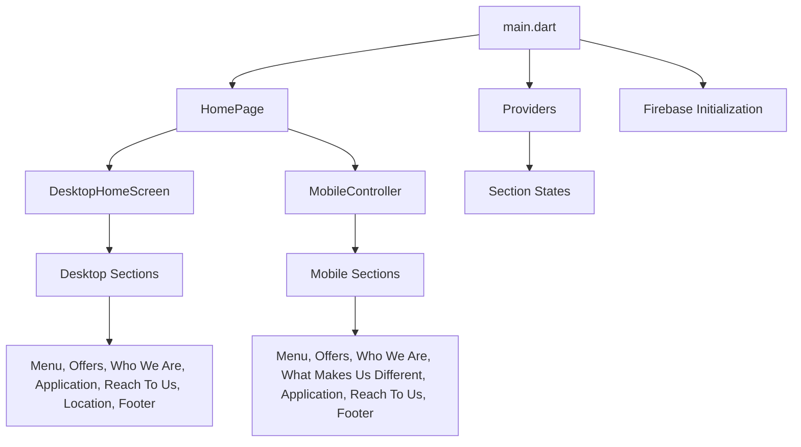
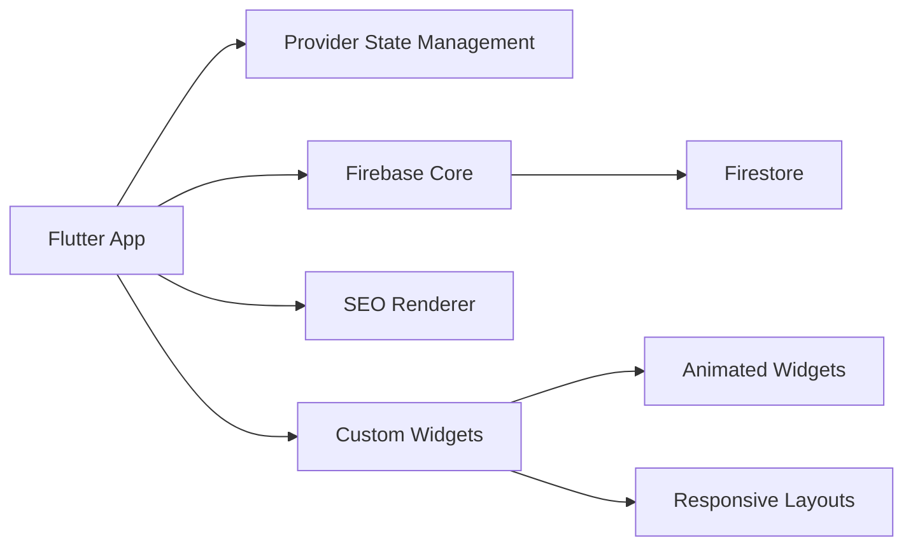
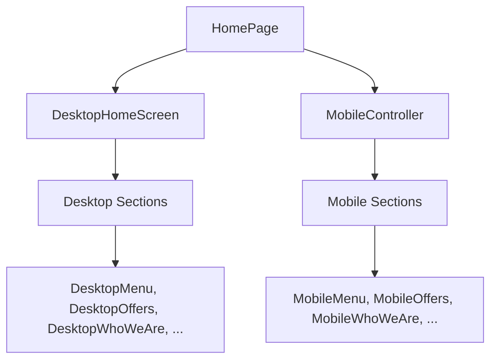

  

# 🍔 **Royal Foods**

---

## ✨ Overview
Royal Foods is a modern, cross-platform food menu and offers application built with Flutter. It provides a seamless, visually rich experience for both web and mobile users, allowing restaurants to showcase their menu, offers, and brand story interactively. The app is designed for scalability, performance, and beautiful UI/UX.

---

## 📝 Description
- Royal Foods enables restaurants to present their menu and offers in a visually appealing, interactive way.
- The app supports both desktop and mobile layouts, ensuring a consistent experience across devices.
- Built with a focus on performance, SEO, and modern design principles.

  <td></td>
  <td></td>
  <td></td>
  <td></td>

---

## 🚀 Key Features
- Responsive UI for web and mobile
- Dynamic menu and offers sections
- SEO optimization for web
- Firebase integration for real-time data
- Beautiful, animated transitions and effects
- Multi-provider state management

---

## 🛠️ Core Technical Features
- **Flutter** for cross-platform development
- **Firebase** for backend and hosting
- **Provider** for state management
- **SEO Renderer** for web SEO
- **Custom animated widgets** for engaging UI
- **Cloud Firestore** for real-time data

---

## 💡 Development Skills Applied
- Responsive design and adaptive layouts
- State management with Provider
- Integration with Firebase and Firestore
- Custom widget and animation development
- SEO optimization for Flutter web
- Clean architecture and modular code

---

## 📱 Mobile Development
- Custom mobile controllers for scroll and tab navigation
- Mobile-specific UI components and layouts
- Platform-adaptive theming and navigation

---

## 🧰 Tools & Methodologies
- **Flutter SDK**
- **Firebase** (Hosting, Firestore)
- **Provider**
- **SEO Renderer**
- **Cached Network Image**
- **Git** for version control
- **VS Code/Android Studio** for development

---

## 🏗️ Technology Stack
- **Frontend:** Flutter (Dart)
- **Backend:** Firebase (Firestore, Hosting)
- **State Management:** Provider
- **SEO:** SEO Renderer
- **Image Handling:** Cached Network Image

---

## 🗂️ Application Structure

---

## 🏛️ Technical Architecture

---

## 🖼️ Screen Architecture

---

## 🧩 Tools & Packages Used
- **flutter/material.dart**
- **firebase_core**
- **cloud_firestore**
- **provider**
- **seo_renderer**
- **cached_network_image**

---

## 📋 Step-by-Step: What Does This App Do?
1. **Initialize**: Launches with Firebase and sets up SEO for web.
2. **HomePage**: Detects device type and loads the appropriate layout (desktop or mobile).
3. **Menu & Offers**: Fetches menu and offers from Firestore and displays them with beautiful cards and animations.
4. **Sections**: Shows "Who We Are", "What Makes Us Different", "Our Application", and "Reach To Us" sections.
5. **Footer & Location**: Displays contact info, location, and social links.
6. **Responsive**: Adapts all screens and components for both web and mobile.

---

> _Royal Foods: Where technology meets taste!_ 
